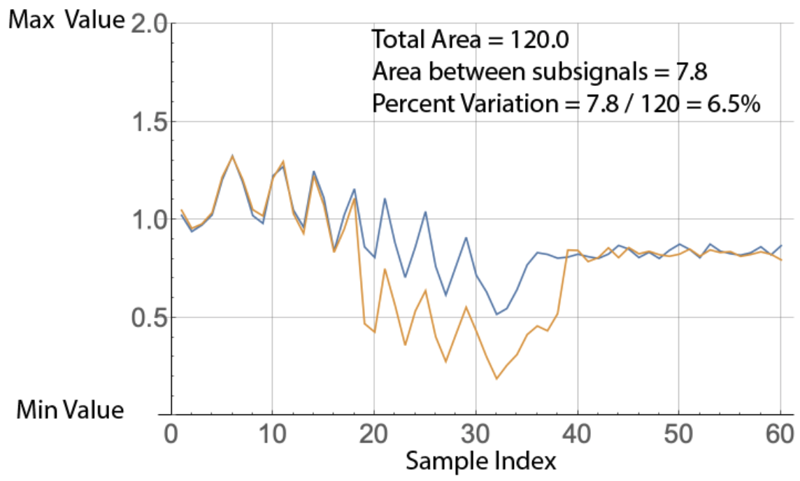

# Guide: Introduction to Clustering with the Boon Nano

The Boon Nano is a high-speed, high-efficiency unsupervised clustering algorithm designed to run in real-time. It builds clusters of similar n-space vectors (or patterns). The composition of the clusters in the Nano machine learning model is based on the four key configuration parameters: Minimum Value, Maximum Value, Pattern Length (or dimension) and Percent Variation (Figure 1). Once these parameters are specified, then each pattern assigned to a cluster will vary by at most Percent Variation from the template pattern of that cluster.

   
*Figure 1: Calculation of percent variation between two patterns*

### Pattern Length

### Percent Variation
In Figure 1, if the Nano is configured for a Percent Variation of 6% or less then the two patterns shown would be assigned to different clusters since their actual percent variation is 6.5%. If the Nano Percent Variation is set to 7% or more then they will be assigned to the same cluster.

### Minimum and Maximum
For each feature in a pattern, a minimum and maximum value must be chosen as part of configuring the Nano. The values to choose for Minimum Value and Maximum Value are fairly straightforward. Generally, one chooses a Min and Max that encompass the range of interest across that feature.

### Streaming Window Size
The Nano works by using the Nano to cluster successive, overlapping subsignals in a stream of incoming samples. The Pattern Length is specified by the user as a Detection Window size and the Minimum Value and Maximum Value for the clustering are also chosen (Figure 2) to represent the range of interest in the signal. Lastly, the Percent Variation determines how fine-grained the clustering of the input stream will be.

 and Pattern Length are

### Autotuning

 

[Return to documentation homepage](../UI-docs.md)
