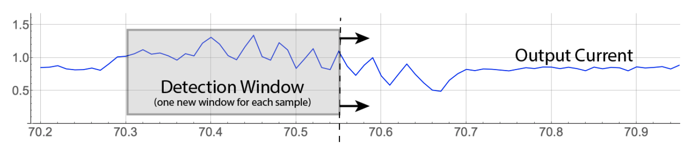

   
# Guide: Introduction to Clustering with the Boon Nano

The Boon Nano is a high-speed, high-efficiency, clustering (or segmentation) algorithm based on unsupervised machine learning. The Nano builds clusters of similar n-space vectors (or patterns) based on the following key configuration parameters:
* Numeric Type: The type of features in each pattern. floating-point (float32), signed integer (int16), unsigned integer (uint16).
* Pattern Length: The number of features or columns in each input vector.
* Range of values for each feature: The minimum and maximum value expected for each feature.
* Percent Variation: Degree of similarity to require between patterns within each cluster.

There are also several less commonly used features
* Weight: You may choose to weight some features more heavily than others (the default weight is 1)
* Streaming Window Size: Generally, set to 1, unless the Nano is being used to stream overlapping windows across data.
* Accuracy: Generally, this is set to the maximum of 0.99.

Once these parameters are specified, then each pattern assigned to a cluster will vary by at most Percent Variation from the centroid of that cluster. Figure 1 shows two input vectors. Since the coordinates of the vector are decimal valued, the appropriate numeric type is floating-point. The Pattern Length of each vector is 60, since there are 60 features in each pattern. The Range of each feature as shown on the Y-axis is from 0.0 to 2.0. It is possible to configure each feature with its own range.

   
*Figure 1: Calculation of percent variation between two patterns*

## Configuration Parameters

### Numeric Type
You must choose one numeric type to apply to all of the features in each input vector. A good default choice for numeric type is float32, which represents 32-bit, IEEE-standard, floating-point values. In some cases, one may know that all features in the input data are always integers ranging from -32,768 and 32,767 (int16) or non-negative integers ranging from 0 to 65,535 (uint16). Using these integer types may may give slightly faster inference times, however, float32 performance is usually similar to the performance for the integer types.

### Pattern Length
The pattern length of each vector to be clustered is the number of features that it has. For example, if each input vector is an FFT across 256 frequency bands then the pattern length would be 256. The inference time needed by the Nano to assign a cluster ID to an input vector is the same regardless of the dimension of the vector. This is a unique property of the Boon Nano relative other unsupervised clustering algorithms.

### Range (Minimum and Maximum)
For each feature in a pattern, the value to choose for each Minimum Value and Maximum Value is fairly straightforward. Generally, you choose a Min and Max that encompass the range of interest across that feature. For example, if one feature in the pattern is from a transducer with values ranging between +/- 10 volts, then one might choose a minimum of -10 and maximum of 10 for that feature.

### Percent Variation
In Figure 1, the percent variation between the two vectors is 6.5%, which is the ratio of the area between the vectors to the total area = Pattern Length (60) x Range (2.0 - 0.0). If the Nano is configured for a Percent Variation of 6% or less then the two patterns shown would be assigned to different clusters. If the Nano Percent Variation is set to 7% or more then these two patterns would be assigned to the same cluster. Selecting smaller values for Percent Variation creates "tighter" clusters and consequently more clusters. Larger values for Percent Variation will segment the input data into fewer, coarser clusters.

### Weight
In some situation, one may want one feature in a pattern to be weighted more heavily than other features in determine the cluster to which it is assigned. For example, assigning a weight of 1 all features gives them equal weight in the clustering. Changing one of those weights to 4 gives that feature four times the weight in the clustering assignment in comparison to features weighted as 1. Assigning a weight of 0 to a feature means it has no effect on the clustering. 

### Streaming Window Size
In streaming window mode, the Nano works by using successive, overlapping subsignals as a stream of incoming samples. Samples in this case are typically time series data. The Pattern Length is specified by the user as a "detection window size" and the minimum Value and Maximum Value for the clustering are also chosen (Figure 2) to represent the range of interest in the signal. The streaming window size is the number of input samples that the window is moved to the right (in time) in forming the next input signal.

   
*Figure 2: A streaming window with pattern length of 250, which means each input vector is 250 successive samples. By setting the streaming window size to 1, we form each waveform by dropping the oldest sample from current input vector and appending the next sample from the input stream.

### Accuracy
In some rare cases, you may choose to reduce the clustering accuracy in order to reduce inference time. This may produce occasional suboptimal assignments of input vectors to clusters, although the results will generally still be good. For example, streaming IoT applications where "lossy" clustering results are acceptable may benefit from adjusting this parameter. Accuracy is a value ranging from 0.75 to 0.99. The default value of 0.99 produces the highest accuracy results while still ensuring very good performance. 

## Autotuning

### Autotuning Range
Once the Pattern Length and numeric type of a block of data are selected, the Boon Nano has the ability to automatically select appropriate minimum and maximum values for each range by sampling the patterns found in that block of data. When autotuning range you must select one of two options
* Autotune by feature: In this case, sampling is done separately for each column. This may be important, for example, if values in the input vector come from different types of sensor measurements.
* Autotune overall: In this case sampling is done uniformly across all samples in the input data. This produces one minimum value and one maximum value that will be used for all features.
Autotuning basically works through outlier rejection. The minimum is the 0.5th percentile and the maximum is the 99.5th percentile of the sampled data. If those percentiles are the same, then the actual sampled minimum and maximum values are used.

### Autotuning Percent Variation
One of the most difficult parameters to configure in unsupervised machine learning is the desired number of clusters needed to produce the best results (as with K-means) or (in the case of the Boon Nano) the desired Percent Variation to use. This is because one would not generally know *a priori* the underlying proximity structure of the input vectors to be segmented.

Once the Pattern Length and Numeric Type of a block of data are selected, the Boon Nano can automatically tune its Percent Variation to create an balanced combination of **coherence within clusters** and **separation between clusters**. In nearly all cases, autotuning produces the best value for the Percent Variation parameter. However, if more granularity is desired you can lower the Percent Variation manually after autotuning. Similarly, if the autotuned Percent Variation is creating too much granularity (and too many clusters) then you can choose to manually increase the Percent Variation above the autotuned value. 
 
## Clustering Results

#### ID
The Boon Nano assigns a cluster ID to each input vector in the order it is received. The first vector is always assigned to a new cluster 1. The next vector, if it is within the defined Percent Variation of cluster 1, is also assigned to cluster 1. Otherwise it is assigned to a new cluster 2. Continuing this way all vectors are assigned cluster IDs in such a way that each vector in each cluster is within the desired Percent Variation of that cluster's centroid. In some circumstances the "no cluster ID" value of 0 may be assigned to a vector. This happens if learning has been turned off (an option within the Nano) or if the maximum cluster count has been reached. It should be noted that cluster IDs are assigned serially so having similar cluster IDs (for instance, 17 and 18) says nothing about the similarity of those clusters. However, PCA (see below) can be used to measure relative proximity of clusters to each other.

### Raw Anomaly Index (RI)
The Boon Nano assigns to each pattern a Raw Anomaly Index, that indicates how many patterns are in its cluster relative to other clusters. These integer values range from 0 to 1000 where values close to zero signify patterns that are the most common and happen very frequently. Values close to 1000 are very infrequent and are considered more anomalous the closer the values get to 1000.

When learning is turned off, patterns with cluster IDs of 0 have a raw anomaly index of 1000.

### Smoothed Anomaly Index (SI)
Building on the raw anomaly index, we create a Smoothed Anomaly Index which is an edge-preserving, exponential, smoothing filter applied to the raw anomaly indexes of successive input patterns. These values are also integer values ranging from 0 to 1000 with similar meanings as the raw anomaly index. In cases where successive input patterns do not indicate any temporal or local proximity this smoothing may not be meaningful.

### Frequency Index (FI)
Similar to the anomaly indexes, the Frequency Index measures the relative number of patterns placed in each cluster. The frequency index measures all cluster sizes relative to the average size cluster. Values equal to 1000 occur about equally often, neither abnormally frequent or infrequent. Values from close to 0 are abnormally infrequent, and values above significantly above 1000 are abnormally frequent.

### Distance Index (DI)
The Distance Index measures the distance of each cluster centroid to the centroid of all of the cluster centroids. This overall centroid is used as the reference point for this measurement. The values range from 0 to 1000 indicating that distance with indexes close to 1000 as indicating patterns furthest from the center and values close to 0 are abnormally close. Patterns in a space that are similar distances appart have values that are close to the average distance between all clusters to the centroid. On average, these values do not vary a lot in value, but that is not to say that they can't.
 

 

[Return to documentation homepage](../UI-docs.md)
